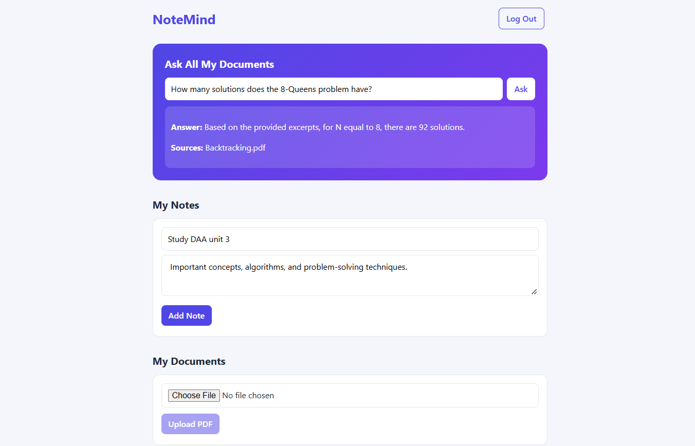

# NoteMind

> Upload your PDFs and ask questions that are answered **from your own documents**, using retrieval-augmented generation (RAG) built from scratch.



NoteMind is a full-stack web app with user accounts, notes, and PDF upload. Its main feature is a document Q&A system: you can chat with a single PDF or search across all of your PDFs at once, and the answer tells you which files it came from. If your documents don't contain the answer, it says so instead of guessing.

## Features

- **Authentication:** sign up and log in with JWT tokens and bcrypt-hashed passwords
- **Per-user data:** every query is scoped to the logged-in user, so nobody can read or edit anyone else's notes or documents
- **Notes:** create, edit, and delete
- **PDF upload:** files are validated (PDF only, 10 MB limit), saved, and their text is extracted
- **Chat with one PDF:** ask questions about a single document
- **Ask all documents:** semantic search across every PDF you've uploaded, with the source files shown
- **Out-of-scope detection:** questions your documents can't answer are rejected using a similarity threshold

## How the RAG pipeline works

```
Upload PDF -> extract text -> split into overlapping chunks -> embed each chunk -> store in MongoDB

Ask question -> embed question -> cosine similarity vs. all chunks -> keep chunks above threshold
             -> send only those chunks + question to the LLM -> answer + sources
```

1. **Chunking:** text is split into 500-character chunks with 50 characters of overlap, so ideas cut at a boundary aren't lost.
2. **Embedding:** each chunk is converted into a 3072-dimension vector with Google's embedding model and stored with its text.
3. **Retrieval:** the question is embedded the same way and compared to every chunk using cosine similarity, implemented by hand.
4. **Threshold:** chunks scoring below 0.55 are discarded. I picked this value by measuring real scores: questions covered by my documents scored about 0.6 to 0.7, while unrelated ones scored about 0.5.
5. **Grounded generation:** only the top chunks are sent to the LLM, with an instruction to answer using only those excerpts. If the answer isn't there, it says so. This reduces made-up answers.

## Tech stack

| Layer | Technology |
|---|---|
| Frontend | React (Vite) |
| Backend | Node.js, Express |
| Database | MongoDB Atlas, Mongoose |
| Auth | JSON Web Tokens, bcrypt |
| Uploads and parsing | Multer, pdf-parse |
| AI | Google Gemini API (text generation and embeddings) |

## Project structure

```
notemind/
├── backend/
│   ├── index.js            # routes and server
│   ├── models/             # User, Note, Document, Chunk
│   ├── middleware/         # auth (JWT check), upload (Multer config)
│   └── utils/              # chunking, embeddings, similarity
└── frontend/
    └── src/
        ├── App.jsx         # main page, notes, login state
        ├── Auth.jsx        # login / signup form
        ├── Documents.jsx   # upload and document list
        ├── Chat.jsx        # chat with one PDF
        ├── AskAll.jsx      # search across all PDFs
        └── index.css       # styling
```

## Run it locally

**You need:** Node.js, a free [MongoDB Atlas](https://www.mongodb.com/atlas) database, and a free [Gemini API key](https://aistudio.google.com/app/apikey).

```bash
git clone https://github.com/sreevarshinidesa/notemind.git
cd notemind/backend
npm install
mkdir uploads
```

Create a file named `backend/.env`:

```
MONGO_URI=your_mongodb_connection_string
JWT_SECRET=any_long_random_string
GEMINI_API_KEY=your_gemini_api_key
```

Start the backend:

```bash
node index.js
```

In a second terminal, start the frontend:

```bash
cd frontend
npm install
npm run dev
```

Open http://localhost:5173.

> In MongoDB Atlas, make sure your IP address is allowed under **Network Access**, otherwise the backend can't connect.

## API endpoints

All routes except signup and login need an `Authorization: Bearer <token>` header.

| Method | Route | Purpose |
|---|---|---|
| POST | `/auth/signup` | Create an account |
| POST | `/auth/login` | Log in and get a token |
| GET, POST | `/notes` | List notes, create a note |
| GET, PUT, DELETE | `/notes/:id` | Read, update, delete one note |
| GET, POST | `/documents` | List documents, upload a PDF |
| POST | `/documents/:id/chat` | Ask a question about one PDF |
| POST | `/chat` | Ask a question across all PDFs |

## Challenges I solved

- **CORS errors** between the frontend and backend running on different ports
- **Database connection failures:** free Atlas clusters pause after inactivity, and IP allow-lists block connections from new networks
- **Library API changes:** `pdf-parse` v2 uses a different class-based API from v1, so I had to read its docs and rewrite the extraction code
- **Deprecated AI models:** model names I started with were retired, so I switched to currently available ones
- **Choosing the similarity threshold** with measured scores instead of guessing

## Known limitations and future work

- Scanned or handwritten PDFs don't work, because text extraction needs real embedded text. Adding OCR would fix this.
- Similarity search loads a user's chunks into memory. A vector database such as MongoDB Atlas Vector Search or pgvector would be needed at larger scale.
- Documents can't be deleted yet.
- The login token is stored in `localStorage`. An httpOnly cookie would be safer.
- The API address is hard-coded for local use. It should move into an environment variable before deployment.
